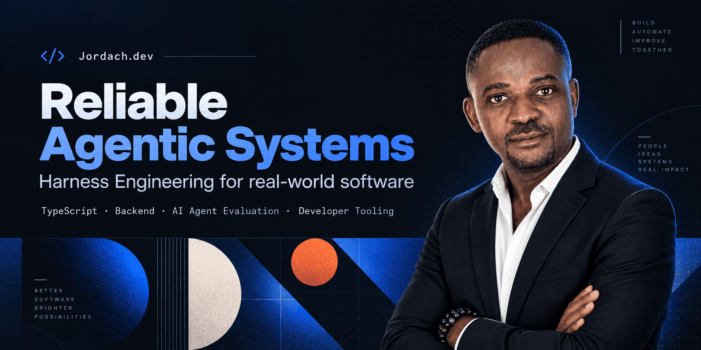

## Hi there 👋



<div align="center">

**TypeScript · Node.js · NestJS · Python** &nbsp;·&nbsp; Casablanca, Morocco — CET, full EU overlap, 4–5h US East

[](https://jordach.dev)
[](https://www.linkedin.com/in/jordachmakaya/)
[](https://www.npmjs.com/~jordach)
[](mailto:jordach@jordach.dev)

</div>

---

I came to software from insurance claims operations. That is where the bias in everything below comes from: **in claims, an unverified assumption has a financial consequence.** So I build systems that are deterministic, traceable and auditable.

One rule runs through all of it:

> ### VERIFIED ≠ DECLARED
> A task passes only with reproducible proof.

Moving into software full time after building it in parallel since 2021, alongside a full-time claims role. Open to backend, platform and agentic engineering roles — remote, contractor (B2B / Deel) or EOR.

---

## Published packages

Live badges — the numbers below come from npm, not from me.

| Package | Version | Downloads | |
|---|---|---|---|
| [`@hardmachinelabs/index-ai-validator`](https://www.npmjs.com/package/@hardmachinelabs/index-ai-validator) |  |  | Validates whether a site correctly exposes an AI-readable layer: `/.well-known/index-ai.json`, `/agent-index.json`, clean Markdown endpoints, declared content size, exposure risks. |
| [`@hardmachinelabs/env-sync`](https://www.npmjs.com/package/@hardmachinelabs/env-sync) |  |  | Syncs `.env` variables into GitHub Actions secrets and GitLab CI/CD variables. Monorepo-aware. Built from watching local, CI and provider secrets drift apart. |
| [`@hardmachinelabs/zod-config`](https://www.npmjs.com/package/@hardmachinelabs/zod-config) |  |  | Runtime config validation for TypeScript and NestJS. Zod schemas as source of truth, fail fast at startup, sensitive values redacted in error output. |

All MIT. All built from a problem I actually hit.

---

## What I am building

Status is stated on every line. Some of this is public and inspectable; some is not yet. I would rather tell you which than let you assume.

### 🔒 Shokunin — delivery harness for AI coding agents
`in development` · `not yet public`

Built on one rule: **agent output stays untrusted until deterministic gates verify it.**

Designed from a catalogued taxonomy of 40 real coding-agent failure modes — context rot, runaway token spend, compaction loops, unverified commits. It keeps specifications, decisions, jobs, evidence and handoffs *outside the chat*, separates CTO / Coder / Tester / Reviewer roles, loads only the context each task requires, and reports through an HTML cockpit.

Bounded context routing — in a 500-file reference repository, active context narrows to 8 explicitly routed files. Sealed module contracts, mechanical quality gates, SHA-256 artifact sealing, append-only decision ledgers. Traced with Langfuse and OpenTelemetry, evaluated against Harbor / Terminal-Bench.

I use it daily. The human provides intent and judgment; the system carries the process.

### 🌐 [index-ai](https://github.com/jordachmakaya/index-ai) — an open proposal for AI-readable websites
`open proposal` · `reference implementation` · `public`

Websites are built for humans; agents read differently. Instead of forcing them to scrape noisy HTML, `index-ai` gives them a clean public layer the publisher controls:

| Component | What it does |
|---|---|
| **Agent Manifest** | Discovery and site declarations |
| **Agent Index** | Structured content inventory |
| **Agent Graph** | Relationships between resources |
| **Agent Interface** | Queryable access |

The goal is not to promise discovery or citations. It is to make agent-facing content publisher-controlled, testable, measurable and verifiable. `index-ai-validator` above is the reference implementation.

### 🔒 Clausis — claims decision engine (French IRSI convention)
`in development` · `private`

Backend of a platform turning water-damage claim declarations into step-by-step handling directives. I chose a **deterministic rules engine over RAG** so every output traces back to a named clause of the *Convention d'Indemnisation et de Recours des Sinistres Immeubles*. NestJS, Mastra AI, SSE streaming, subscription billing with usage metering, SQL analytics.

Comes straight out of the job I still do by hand.

### 🔒 Météosure — weather-claim certification for insurers
`in development` · `private`

Determines whether a severe weather event occurred at a given address on a given date, and returns an adjuster-ready evidence report in under 60 seconds. A Python filtering layer over raw meteorological telemetry, then a NestJS engine applying contractual thresholds. Weekly batch ingestion from Google Drive into Elasticsearch through a three-stage BullMQ/Redis pipeline with Redlock locking and SHA-256 deduplication.

---

## Stack

```
Core        TypeScript · JavaScript · Node.js (v20+) · NestJS · Python
            REST · GraphQL · microservices · event-driven architecture

Data        PostgreSQL · TypeORM · Prisma · Redis + Redlock
            Elasticsearch · Kafka · BullMQ · SQLite

AI/Agents   Mastra AI · MCP (tools & servers) · Anthropic, OpenAI, Google AI
            Langfuse · RAG · Harbor / Terminal-Bench

Delivery    Git · GitHub Actions · GitLab CI/CD · Docker · Dokploy
            Nginx · hardened Linux VPS · Cloudflare R2 · OpenTelemetry

Testing     Vitest · integration & E2E · Zod validation · deterministic CI gates
```

---

## Writing

- **[I Built a CLI to Stop Missing Env Vars from Breaking Deployments](https://dev.to/jordachmakaya/i-built-a-cli-to-stop-missing-env-vars-from-breaking-deployments-59ke)** — dev.to

---

## How I work

Map the workflow end to end. Expose the failure points and the missing capabilities. Then build the software required to close the loop.

I keep decision records, failure analysis, test evidence and release criteria, so every claim I make can be inspected.

> The goal is not to present experiments as traction.
> The goal is to show shipped work, clear engineering judgment, and honest status.

